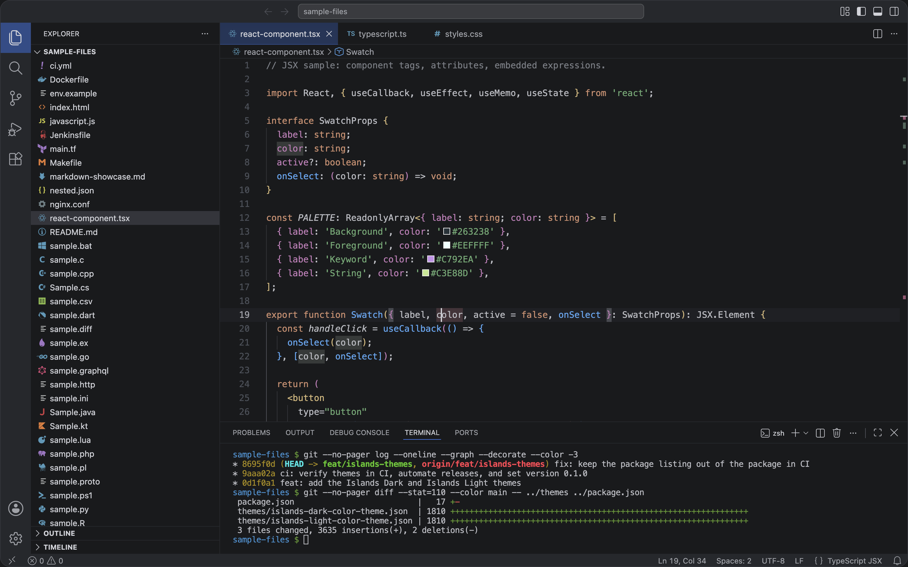
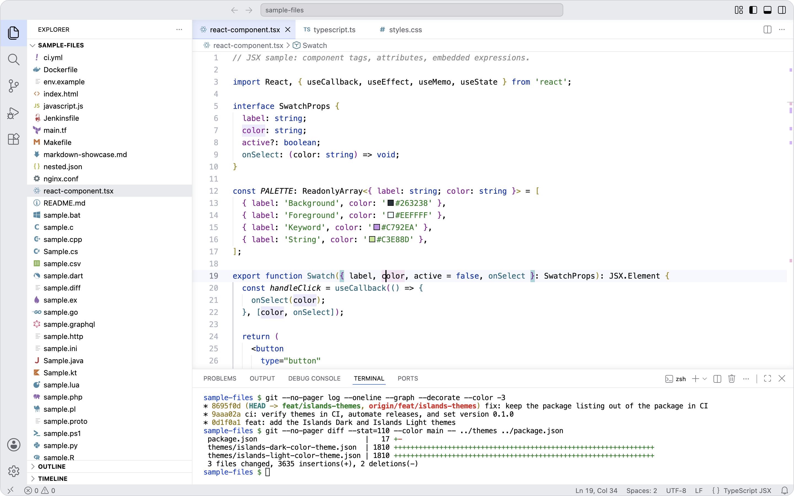

# Themes of Shibbir

[](https://marketplace.visualstudio.com/items?itemName=shibbirweb.themes-of-shibbir)
[](https://marketplace.visualstudio.com/items?itemName=shibbirweb.themes-of-shibbir)
[](https://marketplace.visualstudio.com/items?itemName=shibbirweb.themes-of-shibbir&ssr=false#review-details)
[](https://open-vsx.org/extension/shibbirweb/themes-of-shibbir)
[](https://open-vsx.org/extension/shibbirweb/themes-of-shibbir)
[](https://github.com/shibbirweb/themes-of-shibbir/actions/workflows/ci.yml)
[](LICENSE)

Two themes for Visual Studio Code, Islands Dark and Islands Light. Both set the
editor and side panes on separate island surfaces inside a frame, so every part
of the window reads as its own space.

They are two palettes built for the same layout rather than one palette
inverted, so each is tuned for its own background.

## The themes

### Themes of Shibbir: Islands Dark

The editor and sidebar sit on near-black islands inside a lighter frame, so
each pane reads as its own surface. Syntax colors are warm and calm: orange
keywords, green strings, cyan numbers, blue function declarations, and purple
fields and constants.

Pick this if you like clearly separated panes with a restrained palette.



### Themes of Shibbir: Islands Light

White islands on a soft gray frame. Syntax colors are crisp and dark: navy
keywords, green strings, teal function declarations, and purple fields.

Pick this for the same island layout in a light editor.



Both Islands themes style the whole window, not just the editor: sidebar,
panel, terminal (including ANSI colors), tabs, status bar, menus, widgets,
diff and merge editors, notebooks, source control, and chat. In the diff
editor, deleted lines show gray rather than red, and changed lines blue.

## Where it is published

| Registry | Listing | Identifier |
| --- | --- | --- |
| Visual Studio Marketplace | [marketplace.visualstudio.com](https://marketplace.visualstudio.com/items?itemName=shibbirweb.themes-of-shibbir) | `shibbirweb.themes-of-shibbir` |
| Open VSX | [open-vsx.org](https://open-vsx.org/extension/shibbirweb/themes-of-shibbir) | `shibbirweb/themes-of-shibbir` |

Both listings carry the same build. Open VSX is what VSCodium, Cursor, Gitpod,
Eclipse Theia, and other non-Microsoft builds read from, so the extension
installs there as well as in VS Code.

## Install

From the Extensions view in VS Code, search for **Themes of Shibbir** and click
Install.

From the command line:

```sh
code --install-extension shibbirweb.themes-of-shibbir
```

For an editor that uses Open VSX, install it from that editor's own Extensions
view, or download the `.vsix` from the
[Open VSX listing](https://open-vsx.org/extension/shibbirweb/themes-of-shibbir)
and run:

```sh
codium --install-extension themes-of-shibbir-1.0.0.vsix
```

## Activate

Open the Color Theme picker with `Cmd+K Cmd+T` on macOS or `Ctrl+K Ctrl+T` on
Windows and Linux, then choose **Themes of Shibbir: Islands Dark** or
**Themes of Shibbir: Islands Light**.

Both entries share a prefix, so they appear next to each other in the list.

To set one as your default without opening the picker, add this to your
`settings.json`:

```json
{
  "workbench.colorTheme": "Themes of Shibbir: Islands Dark"
}
```

## Compatibility

Requires VS Code 1.12 or newer, which covers every release since April 2017.

Semantic highlighting is included and applies on VS Code 1.43 and newer. On older
builds it is ignored and syntax coloring falls back to TextMate rules, so the
themes still work, just with less precise coloring in languages that ship a
semantic token provider.

## Upgrading from an earlier version

The early Dark Solid and Dark Shades themes have been removed. If you had one of
them selected, VS Code falls back to its default theme after the update; pick
Islands Dark or Islands Light from the Color Theme picker to switch.

## Feedback

Bug reports and requests go to
[GitHub Issues](https://github.com/shibbirweb/themes-of-shibbir/issues).

If a specific language reads badly, mentioning the language and the construct is
much more useful than a general report, since themes are tuned scope by scope.

## Support

If these themes are useful to you, you can
[buy me a coffee](https://buymeacoffee.com/shibbirweb).

## License

[MIT](LICENSE), Copyright (c) Md. Shibbir Ahmed.
